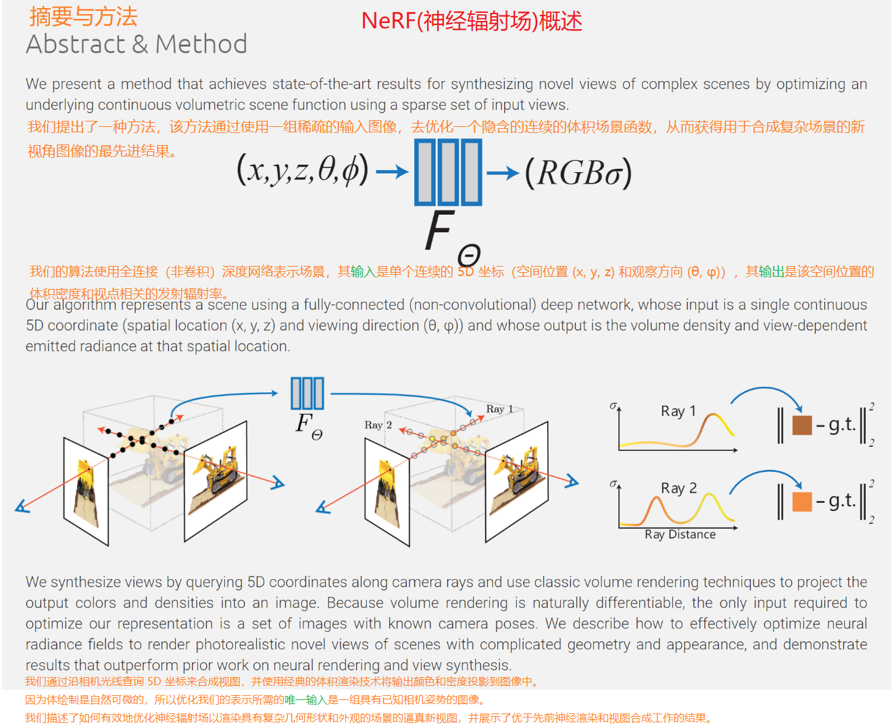

# 颠覆传统三维重建之nerf(一)---概述
>刚开始，啥也不懂，我们看看[官网的概述，也包含了论文和代码：https://www.matthewtancik.com/nerf](https://www.matthewtancik.com/nerf) 。

### 一. 概述

### 二. 看看视频
<video width=640 height=480 src=".images/NeRF-10s.mp4"/>

### 三. 光学物理模型(后面会推导)
- 连续函数数学表达式

- 离散函数数学表达式

### 三. 总结
1. NeRF(神经辐射场)全称:Neural Radiance Fields。
2. 用神经网络建立一个从空间位置到颜色密度的函数F(x,y,z,θ,φ)=rgbδ。
3. nerf三维重建原理：根据F得到颜色密度后，用基于光线步进法的体渲染进行多视角图像投影合成。
4. 转换为常用的三角网三维模型：需要用marching cube算法。
4. 训练方法/优化方法：用一组已知相机位姿的图像。
5. 特点：非常逼真。