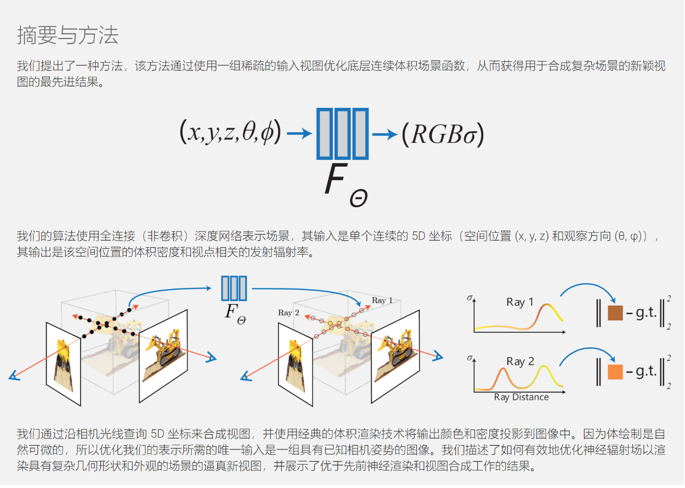

# 颠覆传统三维重建之nerf(一)---概述

### 一句话总结

就1000多行python代码

在计算机图形学里面，有一种三维渲染叫：体渲染。    这个渲染过程可以用来三维重建
1. 作者对体渲染的光学模型做了一下假设，建立一个数学模型。
2. 作者把重建过程离散化后实现可微，也就能反向传播和训练。
3. 作者把其中的两步用深度学习替代。
所以整个过程就是：实现基于神经网络的体渲染方法 的三维重建

特点就是 直接基于拍摄的图像重建， 重建的纹理就来自图像，所以跟真实的场景一模一样

2. [看nerf的视频教程](https://www.bilibili.com/video/BV1d841187tn)
3. [读nerf的论文](https://www.matthewtancik.com/nerf)

