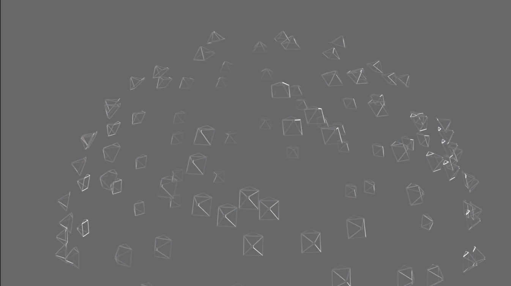
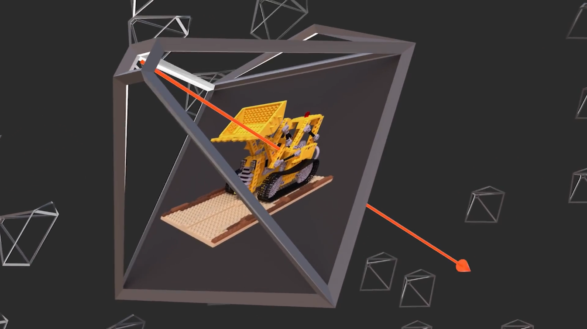
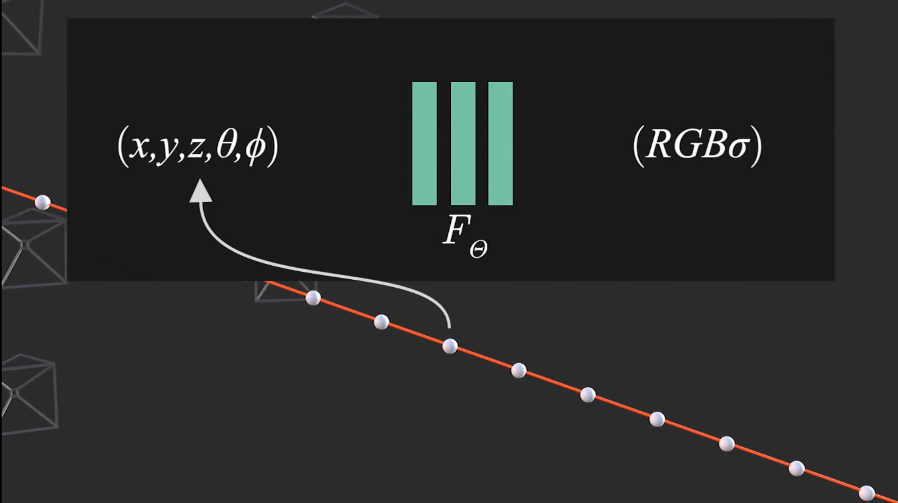

# 颠覆传统三维重建方法之nerf(二)---工作流程与基本原理

### 一. 基本流程
1. 已知相机在不同的位置拍摄了一组目标场景的照片。（如果你是手机拍摄的一段视频可以用colormap转）
    
2. 从相机中心开始，沿着某个像素方向发送一条光线。(注意：跟真实的相机成像模型光线方向是相反的，但不影响)。
    
3. 根据神经网络F，算出光线穿过场景是每个位置的:颜色和密度
    
4. 把这条光线上所有位置上的颜色和密度合成，就能算出图上的像素RGB值。
    
5. 根据输入的一组图像上的像素RGB值，生成无数条光线，不断去优化可微函数FΘ。当优化次数足够，就可以直接使用FΘ算出所有视角下图像的像素RGB值。
    
6. 知道每个位置的颜色和密度，就用marching cube算法转换为三角网三维模型。完成三维重建。
    
>可见，求得FΘ就实现了三维重建，后面都是合成新视角和转换。

### 二. 基本原理
根据上面的流程，大致看出其基本原理：
1. 作者首先把重建过程FΘ用深度学习替代。FΘ(x,y,z,θ,φ)=RGBσ从(空间位置,观察方向）到（颜色，密度）的过程。
2. 作者对光线成像的光学模型做了一些假设，建立一个数学模型。
3. 根据光线成像与输入图像像素不同不断优化，进而优化得出FΘ。
4. 算法的关键：光线成像模型。

### 三. 关于体渲染（完全可以不管）
1. 在计算机图形学里面，有一种三维渲染叫：体渲染。这个渲染过程可以用来三维重建。
2. nerf整个过程就是：实现基于神经网络的体渲染方法的三维重建。
3. 什么是体渲染(体素渲染/光线投射/光线步进)：博客+视频连接：https://zhuanlan.zhihu.com/p/491364937