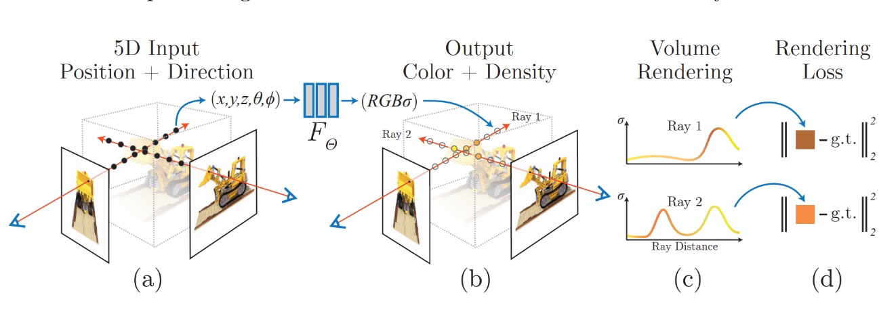
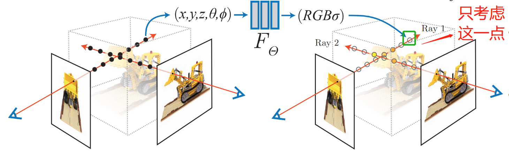
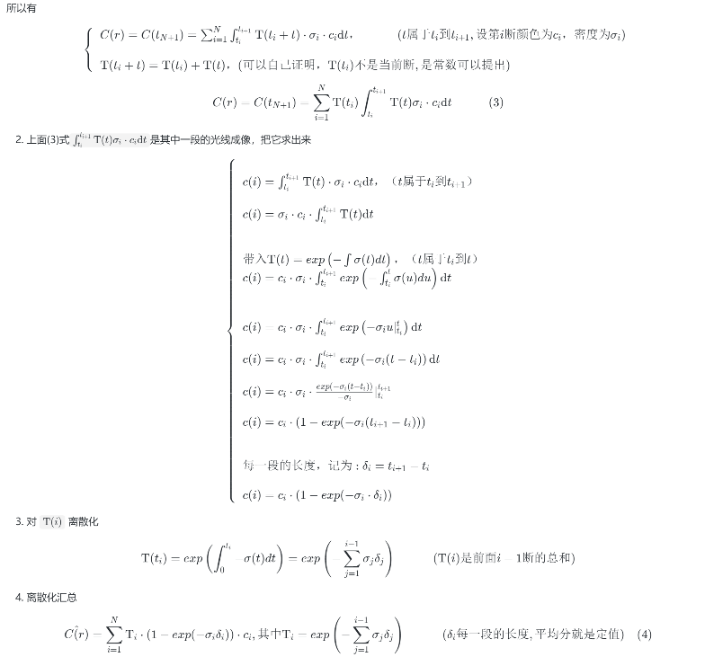
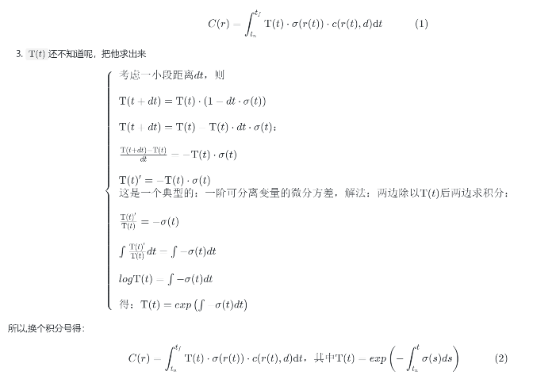

 # 颠覆传统三维重建方法之nerf(三)---NeRF最核心公式推导-光线成像模型
> 欢迎来到nerf最核心的公式证明：怎么合成一条光线上的所有粒子的图像?


### 一. 复习nerf原理
1. nerf认为，图像上一个像素的rgb值 = 从观察点发出，沿着这个像素方向的一条光线上所有粒子的颜色和密度的合成。
2. 那就需要知道：每个位置的颜色和密度RGBσ。 这个可不好算，就用一个神经网络FΘ表达，然后训练得到。
3. 通过输入样本图像与 神经网络FΘ输出的RGBσ生成的图像 的 不同来训练的优化神经网络FΘ 以使其准确。
4. 知道每个位置的颜色和密度RGBσ，就完成了三维重建。 因为可以用RGBσ生成任意视角的图像，也可以转换为三角网。

这里面，最最关键的就是一条光线怎么成像？本文进行数学推导

<!---->

### 二. 物理模型
1. 场景由发光粒子组成。
2. 一条光线上所有位置上的颜色和密度的合成，就是图上的像素RGB值。
3. 只考虑粒子对光线的吸收(由密度σ决定)和发射(由颜色值rgb决定)。
4. 发光粒子的密度σ：只跟位置x,y,z有关。
5. 发光粒子的颜色rgb：除了跟位置x,y,z有关，还有观察角度θ,φ有关。


### 三. 确定目标
>这里假设已经建立神经网络FΘ(x,y,z,θ,φ)=RGBσ可以得到任意位置的颜色和密度。

1. 已知：一条光线上任意位置的颜色和密度RGBσ。
2. 求：这条光线合成的像素点在图像上的RGB值。

### 四. 光线的成像公式推导-连续型，最终结果是(2)式
1. 分析单点P对成像的贡献。P距离距线起点的距离为t, 然后根据上一篇[光线的表示](03.颠覆传统三维重建方法之nerf(三)---光线的数学表示与光线采样.md)知道P点的坐标**r**(t)
    
    <!---->
    - 密度越高，透明度越低，所以单看P点，它的成像颜色就是 c x σ
        - σ=1.0：完全不透明，它的成像颜色就是c x 1.0 = c
        - σ=0.0：完成透明，它的成像颜色就是c x 0.0 = 0
    - 同时，光线从相机出发，由于密度σ的存在，强度不断减弱，不一定能到到P点，到达的概率时记为Τ(t)
        - 可以想象，Τ应该是密度δ和距离t的函数
    - 那么汇总到一起：场景中一点P对光线成像的贡献：Τ(t) x c(r(t)，d) x σ(r(t))。
    - 其中r(t)是光线上点的坐标，d是光线方向，t是光线上点与相机中心距离。
2. 整条光线成像：知道了的单点，整条光线成像就是对光线上所有的点求积分，且考虑光线只需有限区间tn-tf之间，得光线r成像：


<!---->
<!--
```math
C(r) = \int ^{t_f}_{t_n} \Tau(t)  \cdot \sigma(r(t))  \cdot c(r(t),d)  \mathrm{d}t  \quad\quad\quad(1)
```

3. `$\Tau(t)$`还不知道呢，把他求出来

```math
\left \{ \begin{array}{l}
考虑一小段距离dt，则 \\
\\
\Tau(t + dt) = \Tau(t) \cdot (1 - dt \cdot \sigma(t)) \\
\\
\Tau(t + dt) = \Tau(t) - \Tau(t) \cdot dt \cdot \sigma(t) ： \\
 \\
\frac{\Tau(t + dt) - \Tau(t) }{dt}  = - \Tau(t)  \cdot \sigma(t) \\
 \\
\Tau(t)^\prime = - \Tau(t)  \cdot \sigma(t) &\\
这是一个典型的：一阶可分离变量的微分方程，解法 ：两边除以\Tau(t)后两边求积分： \\
 \\
\frac{\Tau(t)^\prime}{\Tau(t)} = -\sigma(t) \\
 \\
\int \frac{\Tau(t)^\prime}{\Tau(t)} dt = \int  -\sigma(t)dt \\
 \\
log\Tau(t) = \int  -\sigma(t)dt  \\
 \\
得：\Tau(t) =  exp\left( \int  -\sigma(t)dt \right)\\
\end{array} \right.

```
所以,换个积分号得：
```math
C(r) = \int ^{t_f}_{t_n} \Tau(t)  \cdot \sigma(r(t))  \cdot c(r(t),d)  \mathrm{d}t ，其中\Tau(t) = exp\left( -\int ^{t}_{t_n} \sigma(s)ds  \right)   \quad\quad\quad(2)
```
-->
### 五. 光线的成像公式推导-离散型，最终结果是(4)式
1. 上面(2)式式连续函数积分，计算机不好算，来把它离散化
    - 离散化：把光线分成N段，不要求一定等分，C(r)变成求每一段的积分 然后再累加。 
    - t_1是起点
    - t_1 到 t_2是     第1段
    - t_2 到 t_3是     第2段
    - t_i 到 t_{i+1}是 第i段 
    - t_N 到 t_{N+1}是 第N段, 最后一段  
    - 假设每一段内有恒定的颜色和密度, 且每一段不一样 
    

<!---->
<!--

所以有
```math
\left \{ \begin{array}{l}
C(r) =  C(t_{N+1}) = \sum^N_{i=1} \int^{t_{i+1}}_{t_i} \Tau(t_i+t)  \cdot \sigma_i  \cdot c_i 
\mathrm{d}t，\quad\quad\quad(t属于t_i 到 t_{i+1}, 设 第i段颜色为c_i，密度为\sigma_i ) \\
\\
\Tau(t_i + t) = \Tau(t_i) + \Tau(t) ，(可以自己证明，\Tau(t_i)不是当前段, 是常数可以提出)  \\
\end{array} \right.
```
```math
C(r) =  C(t_{N+1}) = \sum^N_{i=1} \Tau(t_i) \int^{t_{i+1}}_{t_i} \Tau(t)  \sigma_i  \cdot c_i \mathrm{d}t  \quad\quad\quad(3)
```

2. 上面(3)式`$C(i)=\int^{t_{i+1}}_{t_i} \Tau(t)  \sigma_i  \cdot c_i \mathrm{d}t $`是其中一段的光线成像，把它求出来

```math
\left \{ \begin{array}{l}
 \\
C(i) = \int^{t_{i+1}}_{t_i} \Tau(t) \cdot  \sigma_i  \cdot c_i \mathrm{d}t，（t属于t_i 到 t_{i+1}）  \\
 \\
C(i) = \sigma_i  \cdot c_i \cdot \int^{t_{i+1}}_{t_i} \Tau(t)   \mathrm{d}t \\
 \\
 \\
带入 \Tau(t) = exp\left( -\int \sigma(t)dt  \right) ，（t属于t_i 到 t）  \\
C(i) = c_i \cdot \sigma_i  \cdot \int ^{t_{i+1}}_{t_i} exp\left( -\int ^{t}_{t_i} \sigma(u)du  \right) \mathrm{d}t  \\
 \\
 \\
C(i) = c_i \cdot \sigma_i  \cdot  \int ^{t_{i+1}}_{t_i} exp\left( -\sigma_iu|^t_{t_i}  \right) \mathrm{d}t  \\
C(i) = c_i \cdot \sigma_i  \cdot  \int ^{t_{i+1}}_{t_i} exp\left( -\sigma_i(t-{t_i})  \right) \mathrm{d}t  \\
C(i) = c_i \cdot \sigma_i  \cdot   \frac{exp( -\sigma_i(t-{t_i}))}{-\sigma_i} |^{t_{i+1}}_{t_i} \\
 \\
C(i) = c_i \cdot  (1-exp( -\sigma_i({t_{i+1}}-{t_i}))) \\
 \\
 \\
每一段的长度，记为: \delta_i = t_{i+1}-{t_i} \\
 \\
C(i) = c_i \cdot  (1-exp( -\sigma_i \cdot \delta_i)) \\
\end{array} \right.
```
3. 对 `$\Tau(i)$` 离散化

```math
\Tau(t_i) =   exp\left( \int^{t_i}_0  -\sigma(t)dt \right) = exp\left( -\sum_{j=1}^{i-1}\sigma_j\delta_j  \right)  \quad\quad\quad(\Tau(i)是前面i-1段的总和)
```

4. 离散化汇总

```math
\hat{C(r)} = \sum_{i=1}^{N}  \Tau_i \cdot (1-exp(-\sigma_i\delta_i )) \cdot c_i, 其中 \Tau_i = exp\left( -\sum_{j=1}^{i-1}\sigma_j\delta_j  \right) \quad\quad\quad( \delta_i每一段的长度,平均分就是定值)\quad(4)
\\
\Tau_i：光线穿过前面i-1段后的强度 \\
\\
c_i：第i段的颜色\\
(1-exp( -\sigma_i \cdot \delta_i))：第i段贡献的颜色值。
```
-->