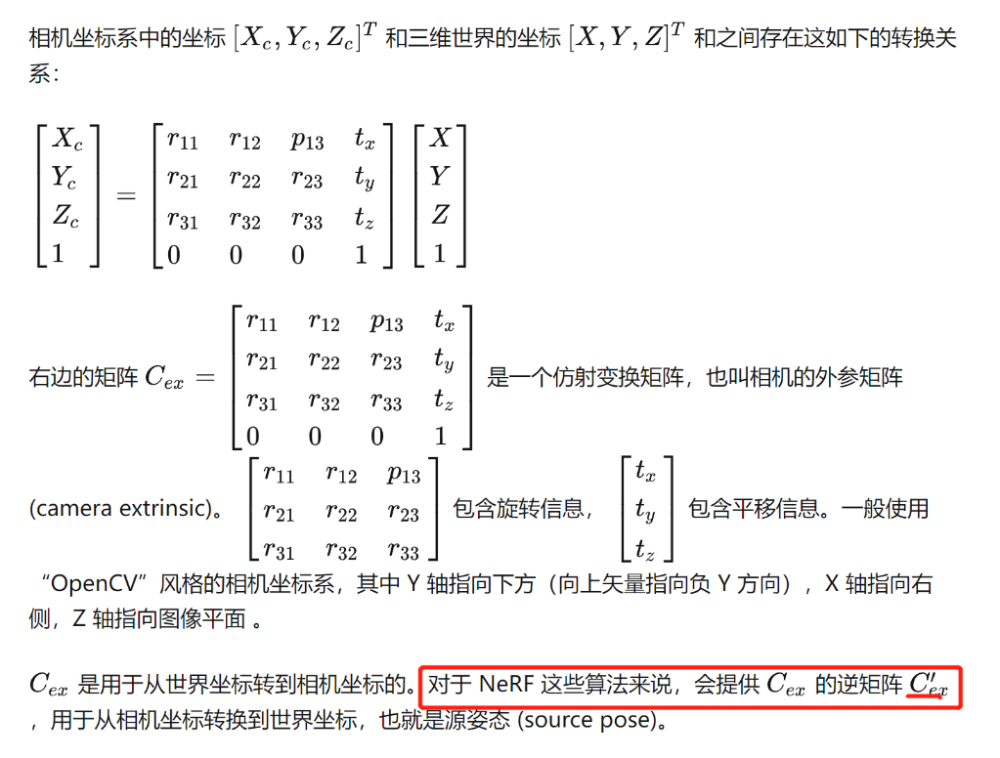

# 颠覆传统三维重建方法之nerf(六)---pytorch-nerf数据格式与数据加载
> pytorch-nerf支持四种数据格式：blender/llff/LINEMOD/deepvoxels,这里以blender的lego乐高数据集为例。

### 一. 带着问题去读代码
1. 相机参数怎么读取和处理？
2. 最终输出的数据格式？

### 二. 看看数据集
1. 训练集：100张800x800的4通道rgba图。
2. 验证集：100张800x800的4通道rgba图。如果每隔testskip=8取一张，一共13张。
3. 测试集：200张800x800的4通道rgba图 + depth图 +  normal图。如果每隔testskip=8取一张，一共25张。
```
$ tree lego
lego
├── test
│   ├── r_0.png
│   ├── r_0_depth_0001.png
│   ├── r_0_normal_0001.png
│   ├── ...其他png
│   ├── r_99.png
│   ├── r_99_depth_0001.png
│   └── r_99_normal_0001.png
├── train
│   ├── r_0.png
│   ├── ...其他png
│   └── r_99.png
├── transforms_test.json
├── transforms_train.json
├── transforms_val.json
└── val
    ├── r_0.png
    ├── ...其他png
    └── r_99.png
3 directories, 803 files
```

### 三. 看看数据集的配置transforms_train.json
- transform_matrix是4x4的矩阵,最后一行是0，0，0，1
```
{
    "camera_angle_x": 0.6911112070083618,
    "frames": [
        {
            "file_path": "./train/r_0",
            "rotation": 0.012566370614359171,
            "transform_matrix": [
                [
                    -0.9999021887779236,
                    0.004192245192825794,
                    -0.013345719315111637,
                    -0.05379832163453102
                ],
                [
                    -0.013988681137561798,
                    -0.2996590733528137,
                    0.95394366979599,
                    3.845470428466797
                ],
                [
                    -4.656612873077393e-10,
                    0.9540371894836426,
                    0.29968830943107605,
                    1.2080823183059692
                ],
                [
                    0.0,
                    0.0,
                    0.0,
                    1.0
                ]
            ]
        },
        #.... 其他帧
    ]
}
```
### 三. 数据格式的输入输出
1. load_blender_data加载
    ```
    #默认testskip=8
    images, poses, render_poses, hwf, i_split = load_blender_data(args.datadir, args.half_res, args.testskip)
    print('Loaded blender:', images.shape, poses.shape, render_poses.shape, hwf, i_split)
    i_train, i_val, i_test = i_split
    near = 2.
    far = 6.

    if args.white_bkgd:
        images = images[...,:3]*images[...,-1:] + (1.-images[...,-1:]) #如果是白色背景，第四个透明度通道取反
    else:
        images = images[...,:3]
    ```
2. 输出数据
    - images：(138, 400, 400, 4) #一共138张图像，100张训练，13张验证，25张测试
    - poses：(138, 4, 4) #138张图像的相机位姿
    - render_poses：torch.Size([40, 4, 4]) #渲染位姿：-30度，半径4,水平一圈40个位置
    - hwf：[400, 400, 555.5555155968841] #高、宽、焦距
    - i_split(i_train, i_val, i_test)：[array([ 0, ..., 99]), array([100, ..., 112]), array([113, ..., 137])] #三类数据的图片索引
    - near = 2. #near平面与相机（光心）的距离
    - far = 6.  #far 平面与相机（光心）的距离
    

### 四. 数据加载过程

其中camera_angle_x变量的含义是FOV in x dimension，即 fov。
[参考](https://blog.csdn.net/OrdinaryMatthew/article/details/125779721)


### 五. 外参矩阵的逆矩阵：transform_matrix[参考](https://zhuanlan.zhihu.com/p/569903357)

可预见，nerf会把所有的图像转换一个统一的世界坐标系下去处理。


