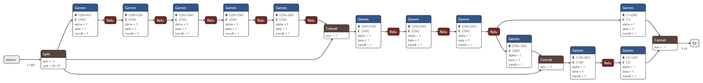

# 7.颠覆传统三维重建之nerf(九)---pytorch-nerf模型创建3之创建NeRF
> 读核心create_nerf函数的代码的get_embedder


```
    #导出模型看看
    torch.onnx.export(model, (torch.randn(1, 90)), "./nerf-model.onnx", verbose=True,training=torch.onnx.TrainingMode.EVAL);
    torch.onnx.export(model_fine, (torch.randn(1, 90)), "./nerf-model-fine.onnx", verbose=True, training=torch.onnx.TrainingMode.EVAL);
    print("+++++++torch.onnx.export finished+++++++")
```



- 输入：1x3
- 经过两次位置编码：1x91，然后有拆分成1x63，1x27
- 1x63做8个全连接层：1x256
.。。
- 最终编程1x4


### 一. 带着问题去读代码
创建了两个模型，默认参数并没有差别
    parser.add_argument("--netdepth", type=int, default=8, 
                        help='layers in network')
    parser.add_argument("--netwidth", type=int, default=256, 
                        help='channels per layer')
    parser.add_argument("--netdepth_fine", type=int, default=8, 
                        help='layers in fine network')
    parser.add_argument("--netwidth_fine", type=int, default=256, 
                        help='channels per layer in fine network')
                        
### 二. NeRF模型创建的核心函数
1. 看调用
```
output_ch = 5 if args.N_importance > 0 else 4
skips = [4]
model = NeRF(D=args.netdepth, W=args.netwidth,
             input_ch=input_ch, output_ch=output_ch, skips=skips,
             input_ch_views=input_ch_views, use_viewdirs=args.use_viewdirs).to(device)
grad_vars = list(model.parameters())

model_fine = None
if args.N_importance > 0:
    model_fine = NeRF(D=args.netdepth_fine, W=args.netwidth_fine,
                      input_ch=input_ch, output_ch=output_ch, skips=skips,
                      input_ch_views=input_ch_views, use_viewdirs=args.use_viewdirs).to(device)
    grad_vars += list(model_fine.parameters())
```
2. 输入
    - D：netdepth
    - W：netwidth
    - input_ch：63, 位置编码的输出
    - output_ch: 默认输出的rgb透射率等5通道数据。output_ch = 5 if args.N_importance > 0 else 4
    - skips = [4]
    - input_ch_views = 27
    - use_viewdirs=args.use_viewdirs = true

### 具体实现，NeRF类
```
# Model
class NeRF(nn.Module):
    def __init__(self, D=8, W=256, input_ch=3, input_ch_views=3, output_ch=4, skips=[4], use_viewdirs=False):
        """ 
        """
        super(NeRF, self).__init__()
        self.D = D
        self.W = W
        self.input_ch = input_ch
        self.input_ch_views = input_ch_views
        self.skips = skips
        self.use_viewdirs = use_viewdirs
        
        self.pts_linears = nn.ModuleList(
            [nn.Linear(input_ch, W)] + [nn.Linear(W, W) if i not in self.skips else nn.Linear(W + input_ch, W) for i in range(D-1)])
        
        ### Implementation according to the official code release (https://github.com/bmild/nerf/blob/master/run_nerf_helpers.py#L104-L105)
        self.views_linears = nn.ModuleList([nn.Linear(input_ch_views + W, W//2)])

        ### Implementation according to the paper
        # self.views_linears = nn.ModuleList(
        #     [nn.Linear(input_ch_views + W, W//2)] + [nn.Linear(W//2, W//2) for i in range(D//2)])
        
        if use_viewdirs:
            self.feature_linear = nn.Linear(W, W)
            self.alpha_linear = nn.Linear(W, 1)
            self.rgb_linear = nn.Linear(W//2, 3)
        else:
            self.output_linear = nn.Linear(W, output_ch)

    def forward(self, x):
        input_pts, input_views = torch.split(x, [self.input_ch, self.input_ch_views], dim=-1)
        h = input_pts
        for i, l in enumerate(self.pts_linears):
            h = self.pts_linears[i](h)
            h = F.relu(h)
            if i in self.skips:
                h = torch.cat([input_pts, h], -1)

        if self.use_viewdirs:
            alpha = self.alpha_linear(h)
            feature = self.feature_linear(h)
            h = torch.cat([feature, input_views], -1)
        
            for i, l in enumerate(self.views_linears):
                h = self.views_linears[i](h)
                h = F.relu(h)

            rgb = self.rgb_linear(h)
            outputs = torch.cat([rgb, alpha], -1)
        else:
            outputs = self.output_linear(h)

        return outputs    

    def load_weights_from_keras(self, weights):
        assert self.use_viewdirs, "Not implemented if use_viewdirs=False"
        
        # Load pts_linears
        for i in range(self.D):
            idx_pts_linears = 2 * i
            self.pts_linears[i].weight.data = torch.from_numpy(np.transpose(weights[idx_pts_linears]))    
            self.pts_linears[i].bias.data = torch.from_numpy(np.transpose(weights[idx_pts_linears+1]))
        
        # Load feature_linear
        idx_feature_linear = 2 * self.D
        self.feature_linear.weight.data = torch.from_numpy(np.transpose(weights[idx_feature_linear]))
        self.feature_linear.bias.data = torch.from_numpy(np.transpose(weights[idx_feature_linear+1]))

        # Load views_linears
        idx_views_linears = 2 * self.D + 2
        self.views_linears[0].weight.data = torch.from_numpy(np.transpose(weights[idx_views_linears]))
        self.views_linears[0].bias.data = torch.from_numpy(np.transpose(weights[idx_views_linears+1]))

        # Load rgb_linear
        idx_rbg_linear = 2 * self.D + 4
        self.rgb_linear.weight.data = torch.from_numpy(np.transpose(weights[idx_rbg_linear]))
        self.rgb_linear.bias.data = torch.from_numpy(np.transpose(weights[idx_rbg_linear+1]))

        # Load alpha_linear
        idx_alpha_linear = 2 * self.D + 6
        self.alpha_linear.weight.data = torch.from_numpy(np.transpose(weights[idx_alpha_linear]))
        self.alpha_linear.bias.data = torch.from_numpy(np.transpose(weights[idx_alpha_linear+1]))


```
