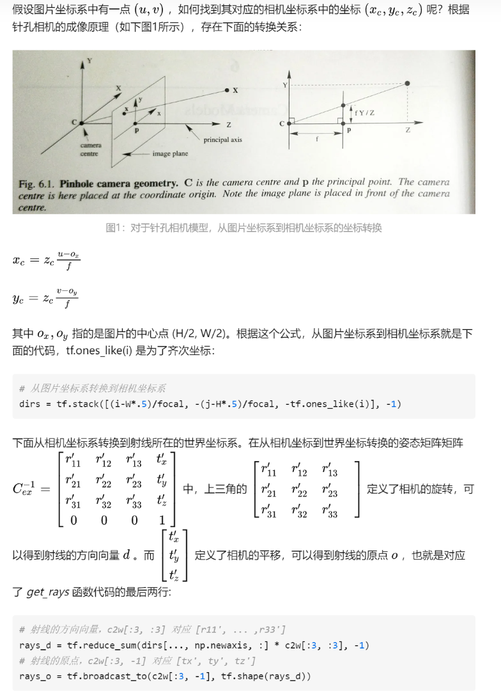

# 颠覆传统三维重建方法之nerf(十二)---pytorch-nerf模型训练2之计算光线
> 根据摄像机的位姿，计算射线 


https://zhuanlan.zhihu.com/p/486686928


get_rays 函数得到射线的原点o和方向单位向量d,都在世界坐标系下了

i.shape: torch.Size([400, 400])
j.shape: torch.Size([400, 400])
dirs.shape: torch.Size([400, 400, 3])
rays_d.shape: torch.Size([400, 400, 3])
rays_o.shape: torch.Size([400, 400, 3])
--- 

```
# Ray helpers
def get_rays(H, W, K, c2w):
    i, j = torch.meshgrid(torch.linspace(0, W-1, W), torch.linspace(0, H-1, H))  # pytorch's meshgrid has indexing='ij'
    i = i.t()
    j = j.t()
    dirs = torch.stack([(i-K[0][2])/K[0][0], -(j-K[1][2])/K[1][1], -torch.ones_like(i)], -1)
    # Rotate ray directions from camera frame to the world frame
    rays_d = torch.sum(dirs[..., np.newaxis, :] * c2w[:3,:3], -1)  # dot product, equals to: [c2w.dot(dir) for dir in dirs]
    # Translate camera frame's origin to the world frame. It is the origin of all rays.
    rays_o = c2w[:3,-1].expand(rays_d.shape)
    return rays_o, rays_d


def get_rays_np(H, W, K, c2w):
    i, j = np.meshgrid(np.arange(W, dtype=np.float32), np.arange(H, dtype=np.float32), indexing='xy')
    dirs = np.stack([(i-K[0][2])/K[0][0], -(j-K[1][2])/K[1][1], -np.ones_like(i)], -1)
    # Rotate ray directions from camera frame to the world frame
    rays_d = np.sum(dirs[..., np.newaxis, :] * c2w[:3,:3], -1)  # dot product, equals to: [c2w.dot(dir) for dir in dirs]
    # Translate camera frame's origin to the world frame. It is the origin of all rays.
    rays_o = np.broadcast_to(c2w[:3,-1], np.shape(rays_d))
    return rays_o, rays_d
```
---

N_rand = 1024
pose是外参逆矩阵，pose.shape = 3x4
K是内参矩阵
    if K is None:
        K = np.array([
            [focal, 0, 0.5*W],
            [0, focal, 0.5*H],
            [0, 0, 1]
        ])
    

rays_o, rays_d = get_rays(H, W, K, torch.Tensor(pose))  # (H, W, 3), (H, W, 3)
输出：
rays_o：400x400x3
rays_d：400x400x3
coords：400x400x2 --> torch.Size([160000, 2])
select_coords: 1024, 2 ；选择1024

batch_rays：2*1024x3 合并了rays_o和rays_d
target_s：1024x3： 从图像上获取1024个像素

---
viewdirs = rays_d


```
# Random from one image
img_i = np.random.choice(i_train)
target = images[img_i]
target = torch.Tensor(target).to(device)
pose = poses[img_i, :3,:4]

if N_rand is not None:
    rays_o, rays_d = get_rays(H, W, K, torch.Tensor(pose))  # (H, W, 3), (H, W, 3)

    if i < args.precrop_iters:
        dH = int(H//2 * args.precrop_frac)
        dW = int(W//2 * args.precrop_frac)
        coords = torch.stack(
            torch.meshgrid(
                torch.linspace(H//2 - dH, H//2 + dH - 1, 2*dH), 
                torch.linspace(W//2 - dW, W//2 + dW - 1, 2*dW)
            ), -1)
        if i == start:
            print(f"[Config] Center cropping of size {2*dH} x {2*dW} is enabled until iter {args.precrop_iters}")                
    else:
        coords = torch.stack(torch.meshgrid(torch.linspace(0, H-1, H), torch.linspace(0, W-1, W)), -1)  # (H, W, 2)

    coords = torch.reshape(coords, [-1,2])  # (H * W, 2)
    select_inds = np.random.choice(coords.shape[0], size=[N_rand], replace=False)  # (N_rand,)
    select_coords = coords[select_inds].long()  # (N_rand, 2)
    rays_o = rays_o[select_coords[:, 0], select_coords[:, 1]]  # (N_rand, 3)
    rays_d = rays_d[select_coords[:, 0], select_coords[:, 1]]  # (N_rand, 3)
    batch_rays = torch.stack([rays_o, rays_d], 0)
    target_s = target[select_coords[:, 0], select_coords[:, 1]]  # (N_rand, 3)
```
