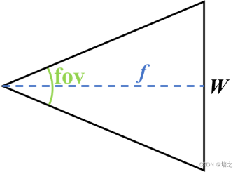
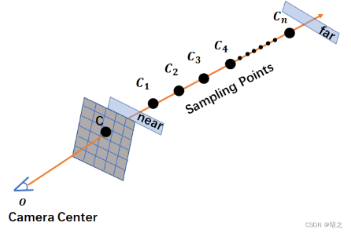
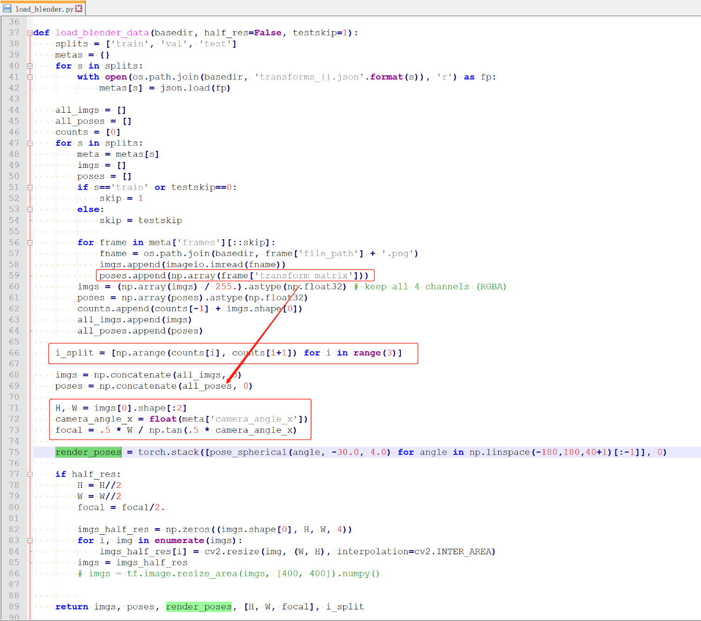

# 颠覆传统三维重建之nerf(六)---pytorch-nerf数据格式与数据加载

### 带着问题
1. 相机参数怎么读取和处理
2. 最终输出的数据格式


### pytorch-nerf支持四种数据格式：
- blender/llff/LINEMOD/deepvoxels
- 这里以blender的lego乐高数据为例

### 看看摄像头参数transforms_train.json
- 4x4的矩阵,最后一行是0，0，0，1
```
{
    "camera_angle_x": 0.6911112070083618,
    "frames": [
        {
            "file_path": "./train/r_0",
            "rotation": 0.012566370614359171,
            "transform_matrix": [
                [
                    -0.9999021887779236,
                    0.004192245192825794,
                    -0.013345719315111637,
                    -0.05379832163453102
                ],
                [
                    -0.013988681137561798,
                    -0.2996590733528137,
                    0.95394366979599,
                    3.845470428466797
                ],
                [
                    -4.656612873077393e-10,
                    0.9540371894836426,
                    0.29968830943107605,
                    1.2080823183059692
                ],
                [
                    0.0,
                    0.0,
                    0.0,
                    1.0
                ]
            ]
        },
        #.... 其他帧
    ]
}
```


### 流程
>默认testskip=8
1. 训练集：100张800x800的4通道rgba图。
2. 验证集：100张800x800的4通道rgba图。每隔testskip=8取一张，一共13张。
3. 测试集：200张800x800的4通道rgba图 + depth图 +  normal图。每隔testskip=8取一张，一共25张。
4. 输出：
- images：(138, 400, 400, 4) #一共138张图像，100张训练，13张验证，25张测试
- poses：(138, 4, 4) #138张图像的相机位姿
- render_poses：torch.Size([40, 4, 4]) #渲染位姿：-30度，半径4,水平一圈40个位置
- hwf：[400, 400, 555.5555155968841] #高、宽、焦距
- i_split(i_train, i_val, i_test)：[array([ 0, ..., 99]), array([100, ..., 112]), array([113, ..., 137])] #三类数据的图片索引
 
### 流程
- images, poses, render_poses, hwf, i_split = load_blender_data(args.datadir, args.half_res, args.testskip)
- i_train, i_val, i_test = i_split
- near = 2.
- far = 6.

camera_angle_x 变量的含义是 FOV in x dimension，即 fov

near far的值是指 near，far 平面与相机（光心）的距离

https://blog.csdn.net/OrdinaryMatthew/article/details/125779721



### 关于transform_matrix