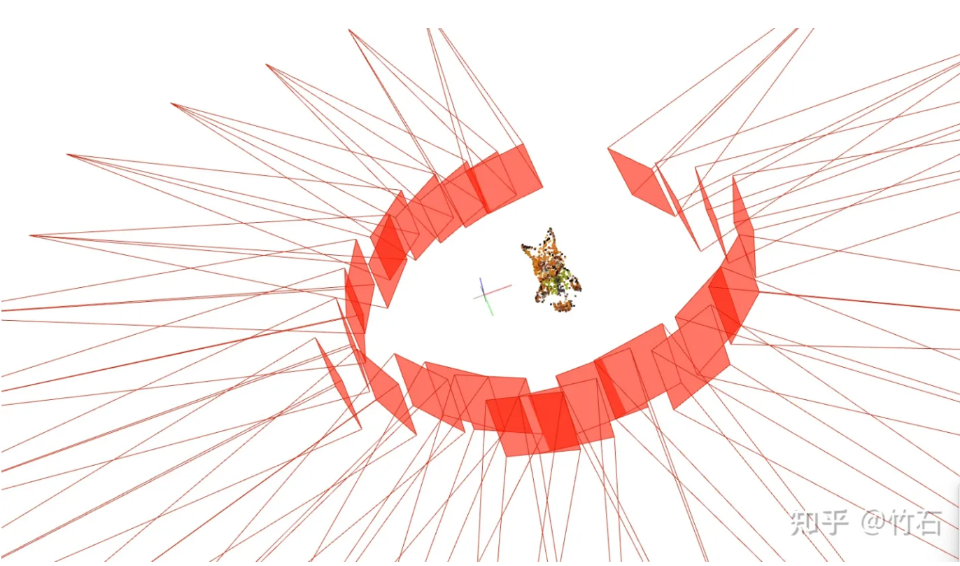
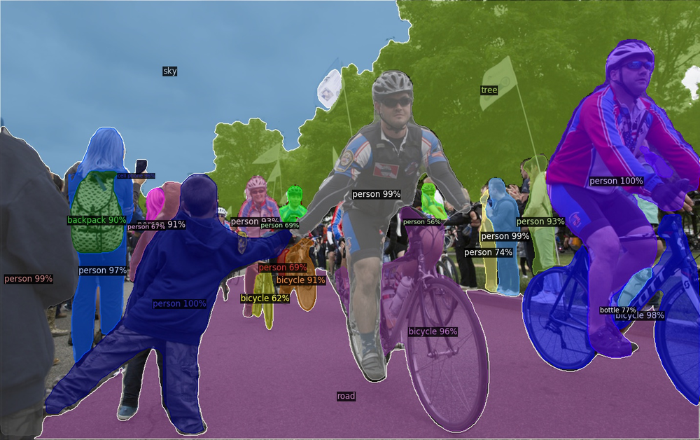

# NeuMan的数据预处理
> 数据预处理：从视频生成训练数据的过程

### 一. 训练数据的结构（参考data/bike）
```
data/bike
├── densepose
├── depth_maps
├── images 
├── keypoints
├── mono_depth
├── segmentations
├── smpl_pred
└── sparse
```
### 二. 预处理依赖项目
 1. [COLMAP](https://github.com/colmap/colmap.git) ：传统多视图三维重建管线。 似乎要求3.6版本。
 
 2. [Detectron2](https://github.com/jiangwei221/detectron2.git) ：目标检测和分割。 
 
 3. [mmpose](https://github.com/jiangwei221/mmpose.git) ：姿态估计。
 
 4. [ROMP](https://github.com/jiangwei221/ROMP.git) : 单目、一阶段、多人的3D人物回归。
 
 5. [BoostingMonocularDepth](https://github.com/compphoto/BoostingMonocularDepth) ：单图三维估计
 
 
 ### 二. 预处理流程
 
 
