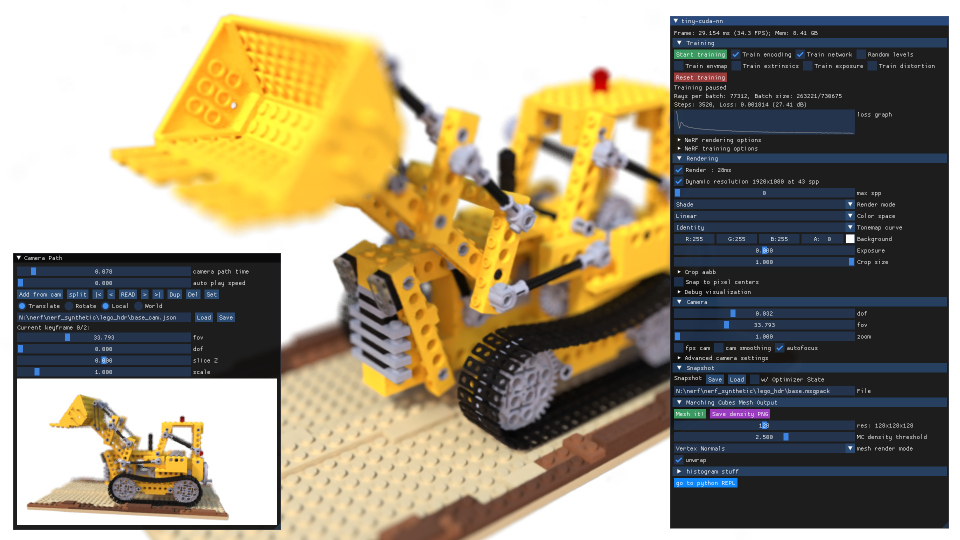
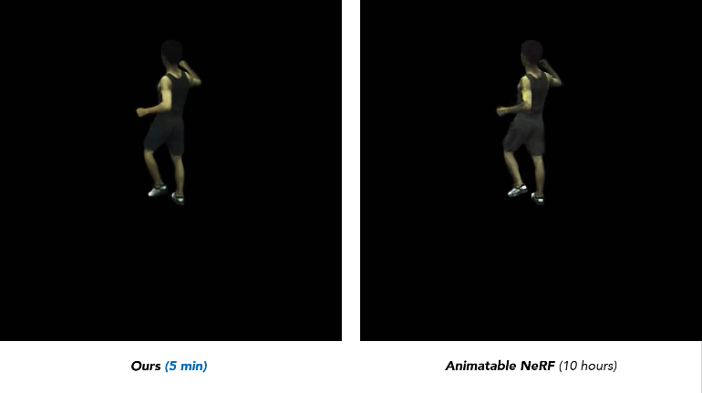
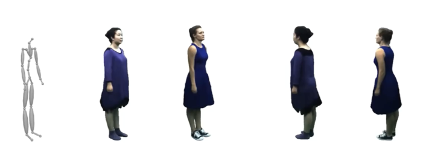
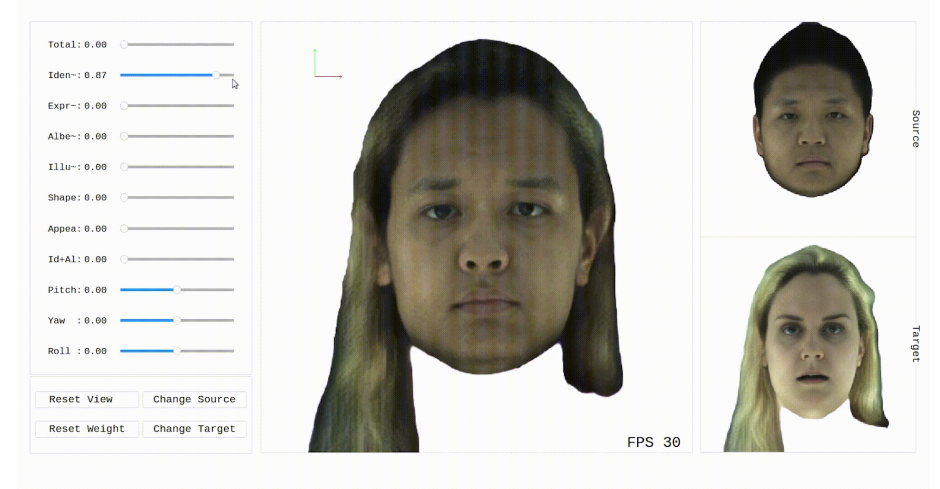
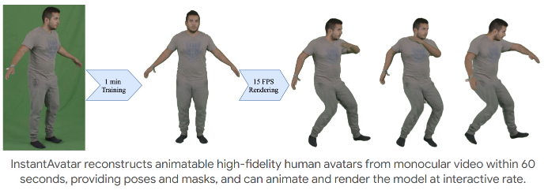
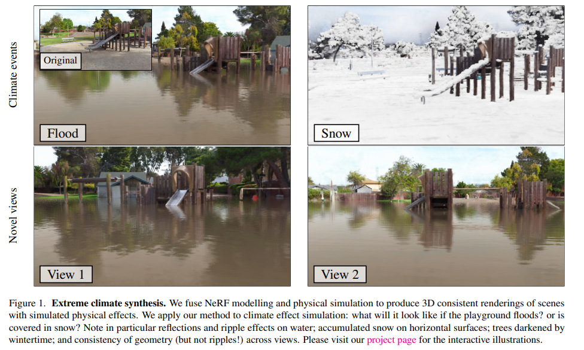
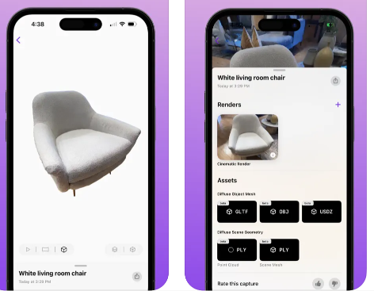
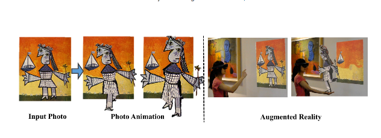

# Nerf(神经辐射场)学习笔记
>本人的科研方向是三维重建与对抗生成，Nerf让人惊叹
>
>争取搞清楚每一个数学公式和每一行代码
    
### 学习交流微信群

### 一. 基本原理
01. [颠覆传统三维重建方法之nerf(一)---概述](nerf/01.颠覆传统三维重建方法之nerf(一)---概述.md)
02. [颠覆传统三维重建方法之nerf(二)---工作流程与基本原理](nerf/02.颠覆传统三维重建方法之nerf(二)---工作流程与基本原理.md)
03. [颠覆传统三维重建方法之nerf(三)---光线的数学表示与光线采样](nerf/03.颠覆传统三维重建方法之nerf(三)---光线的数学表示与光线采样.md)
04. [颠覆传统三维重建方法之nerf(四)---NeRF最核心公式推导-光线成像模型](nerf/04.颠覆传统三维重建方法之nerf(四)---公式推导-光线成像模型.md)
00. [Nerf的右手三维坐标系与OpenGL相同](nerf/Nerf的右手三维坐标系与OpenGL相同.md)
00. [小孔成像与相机模型](nerf/小孔成像与相机模型.md)
00. [小孔成像的逆过程](nerf/小孔成像的逆过程.md)--没有完成，而且有错误
05. [颠覆传统三维重建方法之nerf(五)---相机小孔成像模型的逆变换](nerf/05.颠覆传统三维重建方法之nerf(五)---相机小孔成像模型的逆变换.md)
00. [二维和三维的几何变换](nerf/二维和三维的几何变换.md)

### 二. 读pytorch-nerf项目(**注意：后面的都没有完全整理好**)
06. [颠覆传统三维重建方法之nerf(六)---pytorch-nerf项目介绍](nerf-pytorch/06.颠覆传统三维重建方法之nerf(六)---pytorch-nerf项目介绍.md)
07. [颠覆传统三维重建方法之nerf(七)---pytorch-nerf数据格式与数据加载](nerf-pytorch/07.颠覆传统三维重建方法之nerf(七)---pytorch-nerf数据格式与数据加载.md)
08. [颠覆传统三维重建方法之nerf(八)---pytorch-nerf模型创建1之概述](nerf-pytorch/08.颠覆传统三维重建方法之nerf(八)---pytorch-nerf模型创建1之概述.md)
09. [颠覆传统三维重建方法之nerf(九)---pytorch-nerf模型创建2之位置编码](nerf-pytorch/09.颠覆传统三维重建方法之nerf(九)---pytorch-nerf模型创建2之位置编码.md)
10. [颠覆传统三维重建方法之nerf(十)---pytorch-nerf模型创建3之创建NeRF](nerf-pytorch/10.颠覆传统三维重建方法之nerf(十)---pytorch-nerf模型创建3之创建NeRF.md)
11. [颠覆传统三维重建方法之nerf(十一)---pytorch-nerf模型训练1之概述](nerf-pytorch/11.颠覆传统三维重建方法之nerf(十一)---pytorch-nerf模型训练1之概述.md)
12. [颠覆传统三维重建方法之nerf(十二)---pytorch-nerf模型训练2之计算光线](nerf-pytorch/12.颠覆传统三维重建方法之nerf(十二)---pytorch-nerf模型训练2之计算光线.md)
13. [颠覆传统三维重建方法之nerf(十三)---pytorch-nerf模型训练3之渲染(光线成像)](nerf-pytorch/13.颠覆传统三维重建方法之nerf(十三)---pytorch-nerf模型训练3之渲染(光线成像).md)
14. [颠覆传统三维重建方法之nerf(十四)---pytorch-nerf模型训练4之损失函数](nerf-pytorch/14.颠覆传统三维重建方法之nerf(十四)---pytorch-nerf模型训练4之损失函数.md)
15. [颠覆传统三维重建方法之nerf(十五)---pytorch-nerf模型测试与推理](nerf-pytorch/15.颠覆传统三维重建方法之nerf(十五)---pytorch-nerf模型测试与推理.md)
16. [颠覆传统三维重建方法之nerf(十六)---pytorch-nerf总结](nerf-pytorch/16.颠覆传统三维重建方法之nerf(十六)---pytorch-nerf总结.md)

### 三. 读[instant-ngp](https://github.com/NVlabs/instant-ngp) 源码系列
1. [ngp的各个实现版本列表](instant-ngp/0.ngp的各个实现版本列表.md)
1. [下载编译运行ngp](instant-ngp/1.下载编译运行ngp.md)
2. [读HashNeRF-pytorch项目---理解gnp的hash编码原理](instant-ngp/2.读HashNeRF-pytorch项目---理解gnp的hash编码原理.md)
3. [读ngp官方cuda代码](instant-ngp/3.读ngp官方cuda代码.md)
4. [用colormap和Record3D准备ngp需要的数据集](instant-ngp/4.用colormap和Record3D准备ngp需要的数据集.md)
5. [ngp的模型结构与模型导入导出](instant-ngp/5.ngp的模型结构与模型导入导出.md)

### 四. 读[NeuMan](https://github.com/apple/ml-neuman) (**注意：后面的都没有完全整理好**)
1. [neuman简介](neuman/1-neuman简介.md)
1. [neuman环境搭建](neuman/2-neuman环境搭建.md)
1. [neuman数据准备](neuman/3-neuman数据准备.md)
1. [neuman运行demo](neuman/4-neuman运行和训练bike.md)
1. [neuman的数据预处理](neuman/5-neuman自定义数据集之预处理.md)
1. [neuman的train.py代码框架](neuman/6-neuman的train.py代码框架.md)
1. [neuman训练数据加载](neuman/7-neuman训练数据加载.md)
1. [neuman背景训练](neuman/8-neuman背景训练.md)
1. [neuman人体训练](neuman/9-neuman人体训练.md)
1. [neuman推理之渲染360度人体动作](neuman/10-neuman推理之渲染360度人体动作.md)
1. [neuman推理之渲染测试视角](neuman/11-neuman推理之渲染测试视角.md)
1. [neuman推理之渲染新的指定动作](neuman/12-neuman推理之渲染新的指定动作.md)
1. [neuman推理之多人合并一起渲染](neuman/13-neuman推理之多人合并一起渲染.md)

### 五. nerf模型提升的变种
1. mip-NeRF
1. instant-ngp
1. Block-NeRF
1. Plenoctree
1. Plenoxels：即使没有神经网络，从头训练一个辐射场（radiance field）也能达到 NeRF 的生成质量，而且优化速度提升了两个数量级。
1. Neus
1. RobustNeRF
    - 项目地址：https://robustnerf.github.io/public/
    - 文章地址：https://arxiv.org/pdf/2302.00833.pdf
1. TensoRF-张量辐射场
1. KeypointNeRF
1. point-NeRF
    - 训练更快
1. PixelNeRF
1. IBRNet
1. 压缩模型
    - https://mp.weixin.qq.com/s/hltAHEEVd4_ZTeLXxF1-ow
1. AdaNeRF
    - 自适应采样用于神经辐射场实时渲染
    - https://mp.weixin.qq.com/s/XJTrg-iAOC8PQLjsnmL1oQ
1. NeRF++

### 六. 各种应用场景
1. NGP
    - hash编码的nerf，几秒钟就完成训练。
    - https://github.com/NVlabs/instant-ngp
    
1. NeuMan
    - 基于Nerf的从单个视频实现人体三维重建。
    - 总结：根据已知人体动作使得重建人物运动，不再是简单的360转动场景，人物跳舞了。
    - https://github.com/apple/ml-neuman
    
1. Learning Neural Volumetric Representations of Dynamic Humans in Minutes
    - 在几分钟内学习动态人体的神经体积表示
    - https://zju3dv.github.io/instant_nvr/
    - 个人总结：对NeuMan的速度提升
    
1. Structured Local Radiance Fields for Human Avatar Modeling
    - 基于NeRF自动构建可驱动的实时全身数字人
    - https://arxiv.org/pdf/2203.14478.pdf
    - 个人总结：解决NeuMan的问题和效果提升
    - 视频讲解：https://apposcmf8kb5033.pc.xiaoe-tech.com/detail/l_63e4f0bae4b06159f7389b4a/4
    
1. HeadNeRF
    - 一个实时的基于nerf的参数化的人类头部模型
    - A Real-time NeRF-based Parametric Head Model
    - 论文地址：https://arxiv.org/pdf/2112.05637.pdf
    - 项目主页: https://crishy1995.github.io/HeadNeRF-Project/
    - 代码链接: https://github.com/CrisHY1995/headnerf
    - 介绍：https://m.thepaper.cn/baijiahao_18092004
    
1. InstantAvatar
    - 从 60 秒单目视频中学习数字人化身
    - 项目主页：https://tijiang13.github.io/InstantAvatar/
    - 论文：https://arxiv.org/pdf/2212.10550.pdf
    - 介绍：https://mp.weixin.qq.com/s/4Ad72-s--jL0AWkkGE7gAw
    - 
1. ELICIT
    - 单张图片生成数字人
    - 总结：连视频或者图像集合都不需要，直接从单张图像重建。
    - https://elicit3d.github.io/
    - https://mp.weixin.qq.com/s/76-klqy_kiExjAyh2CVQvA
    
1. 4D-Facial-Avatars
    - 头部位姿和面部表情重建
    - 总结：直接可以重建动态表情，不是静态模型。
    - https://github.com/gafniguy/4D-Facial-Avatars
    - https://blog.51cto.com/u_15717531/5477328
    
1. AD-NeRF 
    - 由音频驱动的nerf，实现Talking Head。
    - 总结：音频驱动，三维重建人物可以说话了。
    - https://yudongguo.github.io/ADNeRF/
    - https://github.com/YudongGuo/AD-NeRF
    
1. CLIP-NeRF 
    - 文字-图像驱动的NeRF操作
    - 总结：用文字或者图像就能驱动图像变成三维模型
    - https://cassiepython.github.io/clipnerf/
    - https://mp.weixin.qq.com/s/DDt6rVGk4inBFkDnlgBpQA
    
1. NeRFFaceEditing
    - 使用NeRF进行人脸编辑
    - http://geometrylearning.com/NeRFFaceEditing/
    - https://mp.weixin.qq.com/s/cv6g-5i9C5ej2CQtI0tEGw
    
1. FENeRF
    - 使用NeRF进行人脸编辑
    - https://mrtornado24.github.io/FENeRF/
    - https://mp.weixin.qq.com/s/G6b9M3PrMjhwRWLJw6GmpQ
    
1. MoFaNeRF
    - 变脸
    - http://github.com/zhuhao-nju/mofanerf
    - https://mp.weixin.qq.com/s/Wmx6l3IDOBV8PH1taka71w
    
1. SURF-GAN
    - 在StyleGAN中注入可控三维感知，NeRF-GAN用于可编辑人像合成
    - https://github.com/jgkwak95/SURF-GAN
    - https://mp.weixin.qq.com/s/QcLsHTKEEgB53Z0oi7kaPA
    
1. ENeRF
    - 真正的动态场景
    - https://zju3dv.github.io/enerf/
    - https://github.com/zju3dv/ENeRF
    - https://mp.weixin.qq.com/s/xuZ6x-ff4WHmGc-vW5j6dw
    
1. StyleNeRF
    - 结合了NeRF和StyleGAN
    - https://github.com/facebookresearch/StyleNeRF
    
1. StylizedNeRF
    - NeRF的风格化
    - http://intelligentgraphics.net/StylizedNeRF/
    
1. HumanNeRF
    - 专注人体三维重建
    - https://grail.cs.washington.edu/projects/humannerf/
    - https://github.com/chungyiweng/humannerf
    
    
1. DiffRF: 
    - 跟扩散模型的结合
    - Rendering-guided 3D Radiance Field Diffusion
    - https://sirwyver.github.io/DiffRF/
    
1. NeRF-SLAM
    - 具有神经辐射场的实时密集单目SLAM
    - https://arxiv.org/pdf/2210.13641.pdf
    - https://mp.weixin.qq.com/s/7ez-Jh9BQMQFtxd6x5OP4Q
1. NeRF-Art
    - 如何把一个正常人变成僵尸风格？用NeRF-Art就可以做到！
    - 论文：https://arxiv.org/abs/2212.08070
    - 代码：https://github.com/cassiePython/NeRF-Art
    - https://mp.weixin.qq.com/s/UlAQLMzAvWNKHi4c6u7ckA
1. 非刚体NeRF
    - https://graphics.tu-bs.de/publications/kappel2022fast
    - https://mp.weixin.qq.com/s/FCmY1Z3ChYEHf-j5P5yKEQ (Nerf集合)
1. ClimateNeRF
    - 它可以渲染出真实的天气效果，包括雾霾、雪和洪水
    - https://arxiv.org/pdf/2211.13226.pdf
    - https://mp.weixin.qq.com/s/6KVUMSk-gLpBtNd9kqjeZw
     
1. [查看更多1](https://github.com/yenchenlin/awesome-NeRF)
1. [查看更多2](https://www.bilibili.com/video/BV1GM41167Vo)
1. [查看更多3](https://www.bilibili.com/video/BV1fL4y1T7Ag)
1. [Nerf集合](https://mp.weixin.qq.com/s/FCmY1Z3ChYEHf-j5P5yKEQ)

### 六. 一些nerf项目
1. SMPL-NeRF：https://github.com/HannesStark/SMPL-NeRF
1. block-nerf：https://waymo.com/intl/zh-cn/research/block-nerf
1. nerf-from-image: https://github.com/google-research/nerf-from-image

### 七. nerf工具箱
1. nerfstudio：https://github.com/nerfstudio-project/nerfstudio
2. multinerf：https://github.com/google-research/multinerf
3. xrnerf：https://github.com/openxrlab/xrnerf

### 八. 各种参考资料/课程/视频
1. https://www.bilibili.com/video/BV1xW4y1g79Q
2. https://www.bilibili.com/video/BV1RM411B7pm

### 九. 商业应用案例
1. NeRF APP
    - 基于NeRF的APP上架苹果商店！照片转3D只需一部手机
    - 这个名叫Luma AI的“NeRF APP”，正式上架App Store后爆火。
    - 苹果appstore下载：https://apps.apple.com/cn/app/luma-ai/id1615849914
    - 
    
### 十. 关于虚拟数字人，数字克隆人
1. [SMPL人体模型](digital-human/1-SMPL人体模型.md)

---
0. 郑泽荣的论文集合：https://zhengzerong.github.io/
0. NeuMan：https://github.com/apple/ml-neuman
1. SMPL-NeRF：https://github.com/HannesStark/SMPL-NeRF
2. HumanNeRF：https://github.com/chungyiweng/humannerf
3. Audio2Face/Audio2Gesture
4. 视觉动作捕捉
5. 语音识别、NLP语音对话、推荐系统、TTS语音合成
6. 人体模型SMPL/+H/-X、SMPLify/+H/-X
7. HybrIK：https://jeffli.site/HybrIK/ 
8. Photo Wake-Up: 
    - 照片大变活人(3D Character Animation from a Single Photo)
    - https://grail.cs.washington.edu/projects/wakeup/
    - 

### 十一. 关于性能指标
在默认设置情况，V100上训练乐高数据：Speed十每秒的迭代次数。
| Model | Split | PSNR(峰值信噪比) | Train Speed | Test Speed |
| - | - | - | - | - |
| instant-ngp (paper)            | trainval?            | 36.39        |  -   | -    |
| TensoRF (paper)                | train (30K steps)    | 36.46        |  -   | -    |
| Instant-ngp (JNeRF)            | -                    | 36.41(5min)  |  -   | -    |

### 十二. 问答
1. [记录网友的一些问题](q-a.md)