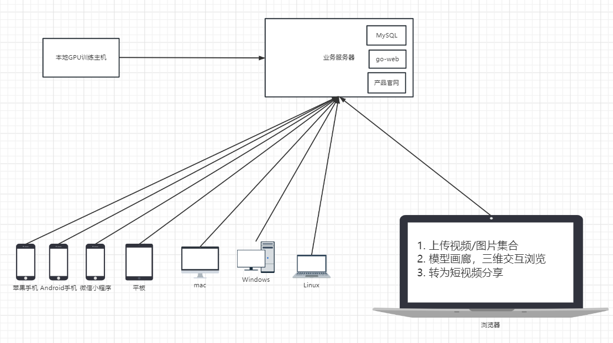

# nerf基础软件平台
> 一个基于nerf基础功能的三维重建软件平台：East-NeRF,Panda-NeRF

### 一.软件组成
1. 数据业务服务器：阿里云
2. ngp-Plenoxel-TensorRF应用：本地GPU训练
3. 7个客户端：ios/android/pc-win/pc-mac/pc-linux/web/小程序。
4. 产品官网：产品介绍
5. 扩展nerf技术：nerf视频课程，nerf博客

### 二. 核心架构

### 三. 技术方案
1. go语言的业务服务，mysql，前端react开发。
2. 本地go语言调用c++的3090ti-2080ti训练
3. 算法：ngp-Plenoxel-TensorRF

### 四. 技术准备
1. ngp的自定义数据集训练
2. 导出模型
3. 客户端渲染方法
4. 导出360度的渲染视频：分享出去
---
5. 对比其他的方案：方便程度，效果，模型，功能

### 五. 规划功能
1. 必须支持COLMAP：从您拍摄的一组照片或视频创建数据集
2. 考虑支持Record3D：使用 iPhone 12 Pro 或更新版本（基于 ARKit）创建数据集

