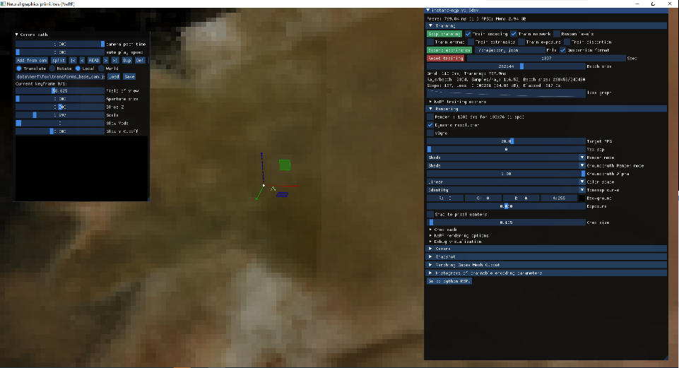

# 下载编译运行ngp

### 一. 下载代码
```
git clone --recursive https://github.com/nvlabs/instant-ngp
cd instant-ngp

#看看依赖项目
$ git submodule foreach --recursive  git remote get-url origin

```
确保依赖库都下载成功

1. 'dependencies/args' https://github.com/Taywee/args
1. 'dependencies/dlss' https://github.com/NVIDIA/DLSS
1. 'dependencies/dlss/NVIDIAImageScaling' https://github.com/NVIDIAGameWorks/NVIDIAImageScaling
1. 'dependencies/eigen' https://github.com/Tom94/eigen
1. 'dependencies/glfw' https://github.com/Tom94/glfw
1. 'dependencies/imgui' https://github.com/ocornut/imgui.git
1. 'dependencies/pybind11' https://github.com/Tom94/pybind11
1. 'dependencies/tiny-cuda-nn' https://github.com/NVlabs/tiny-cuda-nn 
1. 'dependencies/tiny-cuda-nn/dependencies/cutlass' https://github.com/NVIDIA/cutlass 
1. 'dependencies/tiny-cuda-nn/dependencies/fmt' https://github.com/fmtlib/fmt 
1. 'dependencies/tinylogger' https://github.com/Tom94/tinylogger

### 二. windows环境
- vs2019
- python
- cuda13.6，注意官网说支持的10.2编译不过，nvcc编译json.hpp报错
- 光线追踪库OptiX，并设置环境变量OptiX_INSTALL_DIR为安装目录
- vulkan，并设置环境变量VULKAN_SDK为安装目录

### 三. 编译ngp
>直接使用cmake-gui

### 四. 运行ngp
