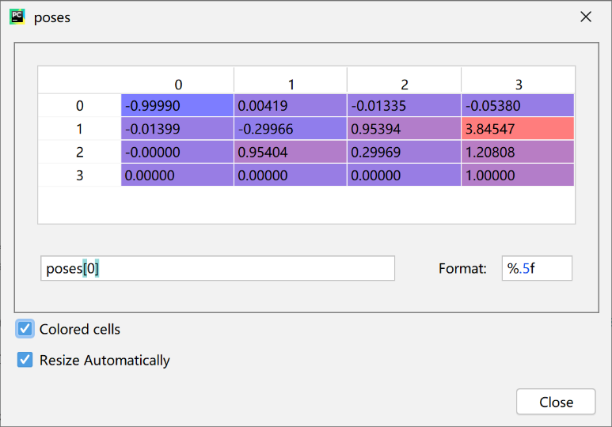

# 颠覆传统三维重建方法之nerf(五)---相机小孔成像模型的逆变换
>nerf是三维重建：已知图像，求真实三维场景。 这是刚好是相机模型的逆变过程。

### 一. 理解需求
1. 知道图像拍摄的相机参数，把图像还原到世界坐标系下的像平面上，然后产生光线完成后续。
2. 输入：可以从lego数据集transforms_train.json看出
    - camera_angle_x： FOV in x dimension，即 fov
    - transform_matrix：内参矩阵的逆矩阵，也就是摄像机位姿pose；4x4的矩阵,最后一行是0，0，0，1
    ```
    {
        "camera_angle_x": 0.6911112070083618,
        "frames": [
            {
                "file_path": "./train/r_0",
                "rotation": 0.012566370614359171,
                "transform_matrix": [
                    [
                        -0.9999021887779236,
                        0.004192245192825794,
                        -0.013345719315111637,
                        -0.05379832163453102
                    ],
                    [
                        -0.013988681137561798,
                        -0.2996590733528137,
                        0.95394366979599,
                        3.845470428466797
                    ],
                    [
                        -4.656612873077393e-10,
                        0.9540371894836426,
                        0.29968830943107605,
                        1.2080823183059692
                    ],
                    [
                        0.0,
                        0.0,
                        0.0,
                        1.0
                    ]
                ]
            },
            #.... 其他帧
        ]
    }
    ```
3. 输出：每个像素所在的世界坐标系
4. 总结需求：输入fov，C，图像；输出图像所在世界坐标系坐标。

在load_blender.py的load_blender_data函数：加载位姿poses和计算焦距focal
```
poses.append(np.array(frame['transform_matrix']))

H, W = imgs[0].shape[:2]
camera_angle_x = float(meta['camera_angle_x'])
focal = .5 * W / np.tan(.5 * camera_angle_x)
```

```
near = 2.
far = 6.

if K is None:
    K = np.array([
        [focal, 0, 0.5*W],
        [0, focal, 0.5*H],
        [0, 0, 1]
    ])

pose = poses[img_i, :3,:4]

```

最重要的光线函数：
```
rays_o, rays_d = get_rays(H, W, K, torch.Tensor(pose))  # (H, W, 3), (H, W, 3)

# Ray helpers
def get_rays(H, W, K, c2w):
    i, j = torch.meshgrid(torch.linspace(0, W-1, W), torch.linspace(0, H-1, H))  # pytorch's meshgrid has indexing='ij'
    i = i.t()
    j = j.t()
    dirs = torch.stack([(i-K[0][2])/K[0][0], -(j-K[1][2])/K[1][1], -torch.ones_like(i)], -1)
    # Rotate ray directions from camera frame to the world frame
    rays_d = torch.sum(dirs[..., np.newaxis, :] * c2w[:3,:3], -1)  # dot product, equals to: [c2w.dot(dir) for dir in dirs]
    # Translate camera frame's origin to the world frame. It is the origin of all rays.
    rays_o = c2w[:3,-1].expand(rays_d.shape)
    return rays_o, rays_d
```

### 一. 推导一遍相机成像模型
相机成像模型，最关键的一点: 深度信息已经丢失；但nerf强制取深度为1, 要在near(2)-far(6)的外面，便于生成光线。

### 二. nerf使用的相机成像逆变换

### 三. nerf的相机参数及其处理


调试看看transform_matrix矩阵
