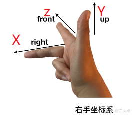
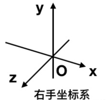
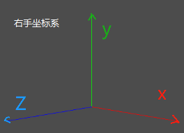
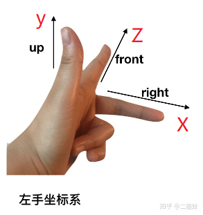
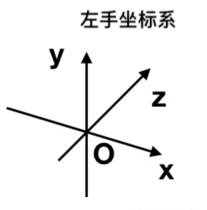
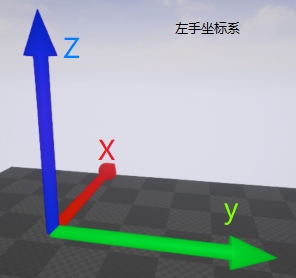
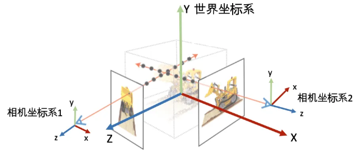
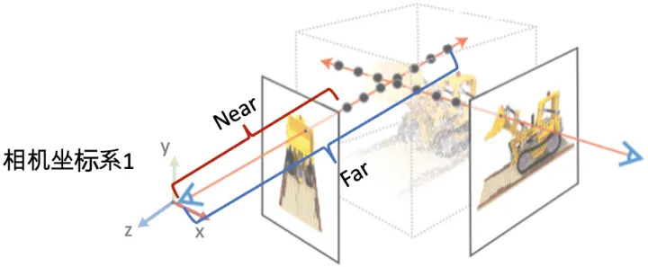
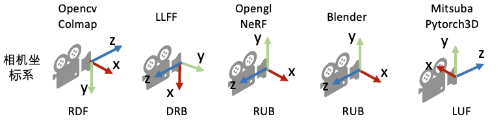

#  Nerf的右手三维坐标系
>注意：nerf是右手三维坐标系，而左手三维坐标系更常见，后面的推导也会用左手。
---
### 一. 三维坐标系分两种：左手坐标系和右手坐标系
> 差别是相反的Z轴方向, 图形学上常分别用红绿蓝三种颜色的三个箭头表示X,Y,Z坐标轴。
1. **右手坐标系**：X轴向右 →，Y轴向上 ↑，Z轴向屏幕外。如**OpenGL，Nerf，LLFF**。

   
   
   
2. **左手坐标系**：X轴向右 →，Y轴向上 ↑，Z轴向屏幕内。如**opencv，colmap，dx，Unity3D，blender，UE虚幻引擎**。

    
    
    
---    
### 二. nerf的右手坐标系
1. nerf采用三维右手坐标系，跟OpenGL一样
    

    
2. 常见的相机坐标系

    

