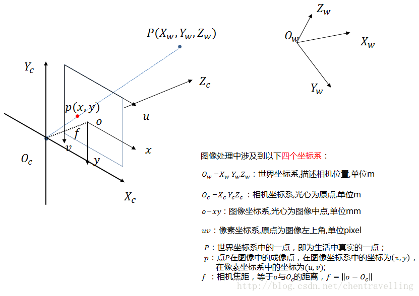
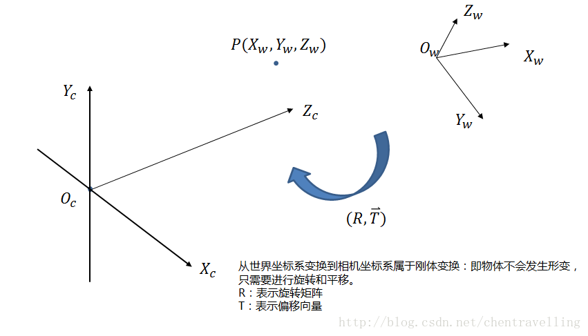
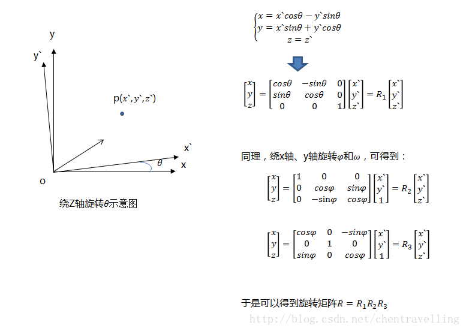
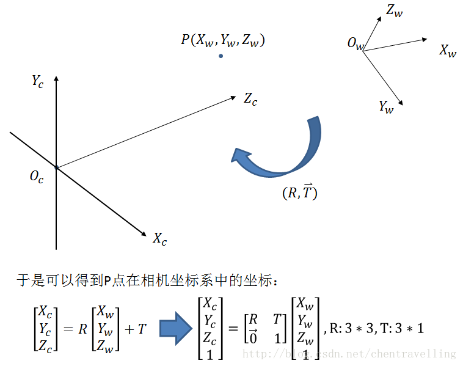
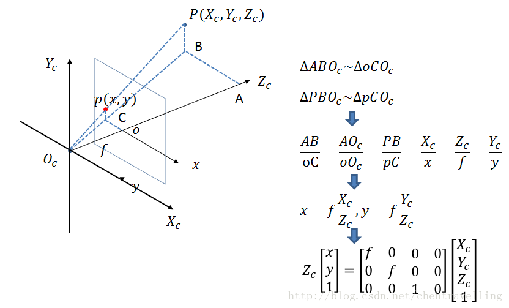
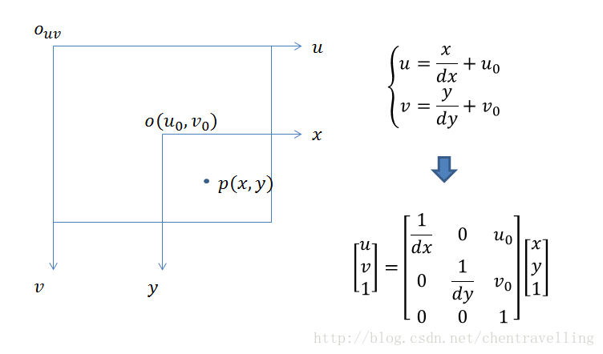
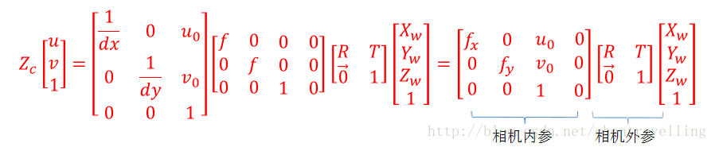
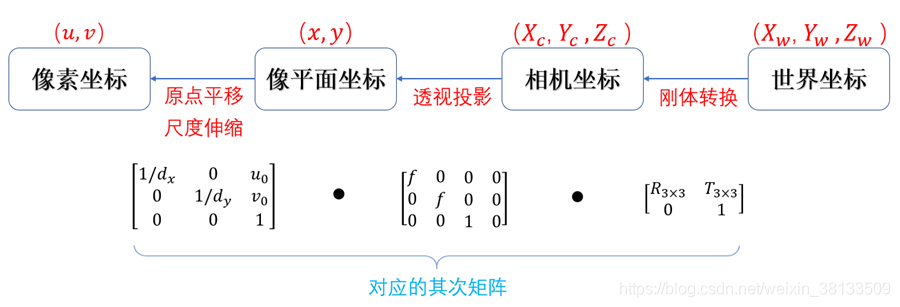

# 小孔成像与相机模型
> 参考[https://blog.csdn.net/chentravelling/article/details/53558096](https://blog.csdn.net/chentravelling/article/details/53558096)

### 一. 四个坐标系
- 世界坐标系
- 相机坐标系
- 图像坐标系
- 像素坐标系
- 小孔成像与相机模型就是：世界坐标系-->相机坐标系-->图像坐标系-->像素坐标系

### 二. 时间坐标系-->相机坐标系

---

---

### 三.相机坐标系-->图像坐标系

- p的单位是距离，mm

### 四. 图像坐标系-->像素坐标系

- 其中dx和dy表示每一列和每一行分别代表多少mm，即1pixel=dx mm
- 后面dx和dy与焦距f合并才内参

### 五. 汇总

- 一个三维点对应一个图像点
- 反过来不行，因为Zc不知道，所以相机拍照深度丢失，才需要三维重建
