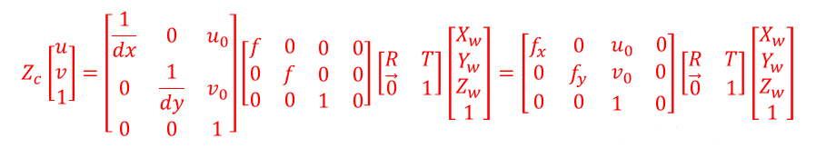
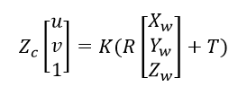
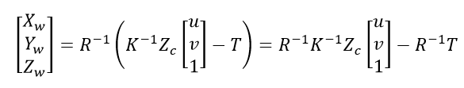
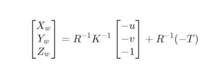
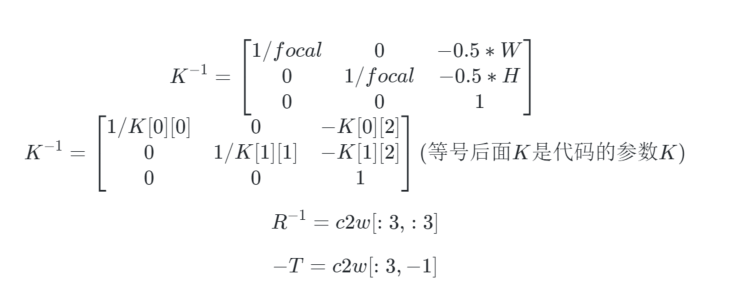

# 小孔成像的逆过程
> 参考[https://blog.csdn.net/zhou4411781/article/details/103876478](https://blog.csdn.net/zhou4411781/article/details/103876478)

https://www.zhihu.com/question/47760591

### 一. 小孔成像逆过程：像素坐标系-->世界坐标系
已知小孔成像模型如下：



简写为：



等式变型：



Nerf 取Zc=-1:


<!--
```math
\left[ \begin{matrix}
X_w \\
Y_w \\
Z_w \\
\end{matrix} \right] = R^{-1}K^{-1} 
\left[ \begin{matrix}
-u \\
-v \\
-1 \\
\end{matrix}  \right] +  R^{-1}(-T)
```
-->

### 二. 看看代码
```
#光计算线的起点和方向向量
def get_rays(H, W, K, c2w):
    i, j = torch.meshgrid(torch.linspace(0, W-1, W), torch.linspace(0, H-1, H))
    i = i.t()
    j = j.t()
    dirs = torch.stack([(i-K[0][2])/K[0][0], -(j-K[1][2])/K[1][1], -torch.ones_like(i)], -1)
    rays_d = torch.sum(dirs[..., np.newaxis, :] * c2w[:3,:3], -1) 
    rays_o = c2w[:3,-1].expand(rays_d.shape)
    return rays_o, rays_d
```

### 三. 分析代码,代码中：

<!--
```math
K^{-1} = \left[ \begin{matrix}
1/focal &0        &-0.5*W \\
0       &1/focal  &-0.5*H \\
0       &0        &1 \\
\end{matrix}  \right]
\\
K^{-1} =
\left[ \begin{matrix}
1/K[0][0]  &0          &-K[0][2] \\
0          &1/K[1][1]  &-K[1][2] \\
0          &0          &1 \\
\end{matrix}  \right] (等号后面K是代码的参数K)

R^{-1} = c2w[:3,:3]

-T =  c2w[:3,-1]
```
-->
